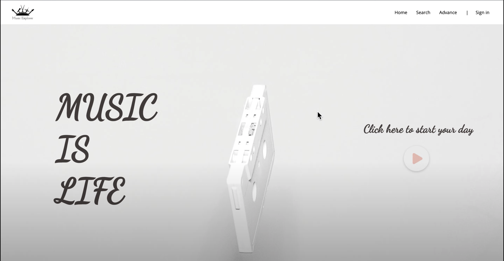
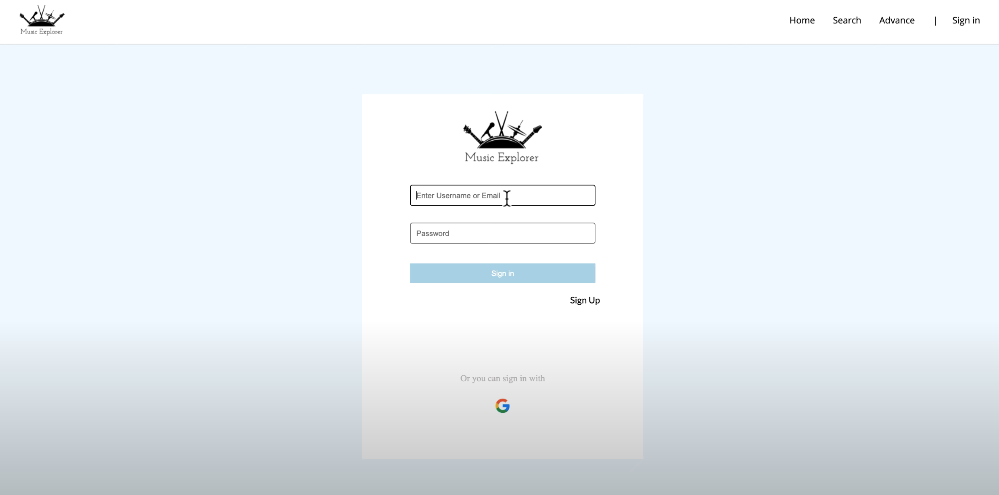
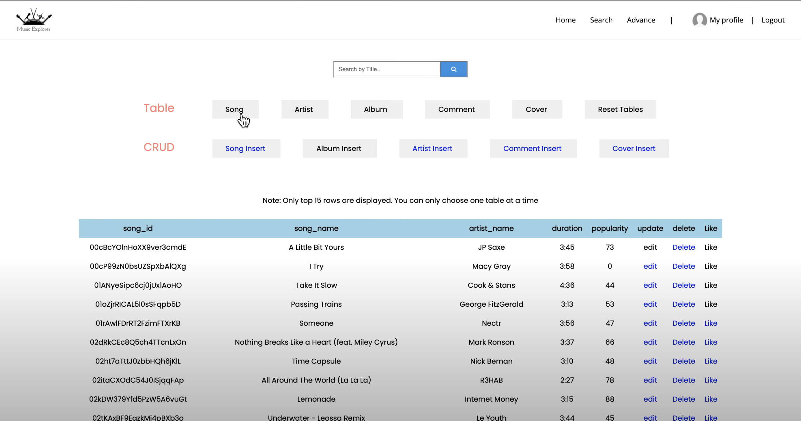
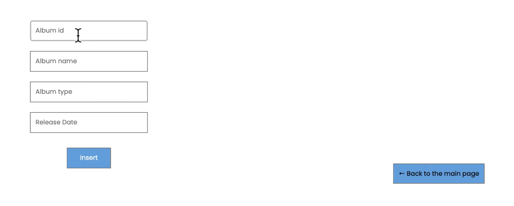
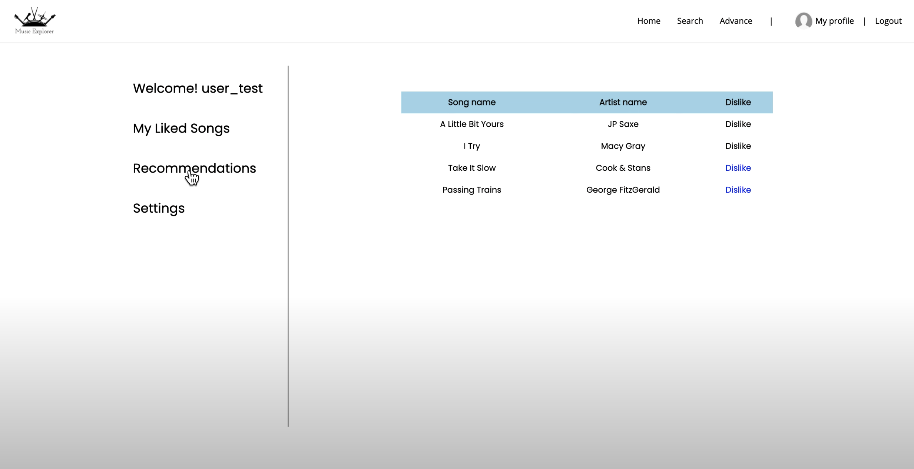

# MusicExplorer
Database course Final Project

## Description
This website is a dynamic website implemented using Python Flask framework and Google Cloud Platform as SQL database.

Enabled user to get, post, delete, update data by interacting with the frontEnd built with HTML, CSS and JavaScript.

Besides, this websites maintain user profile which keep track of songs lik

## GUI
### Home Page

### Login Page

### Data Display

### Create New data entry

### User Profile
