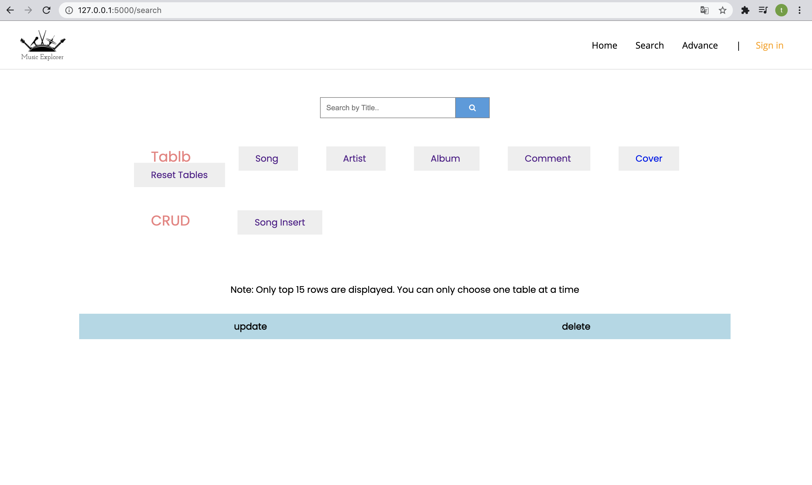
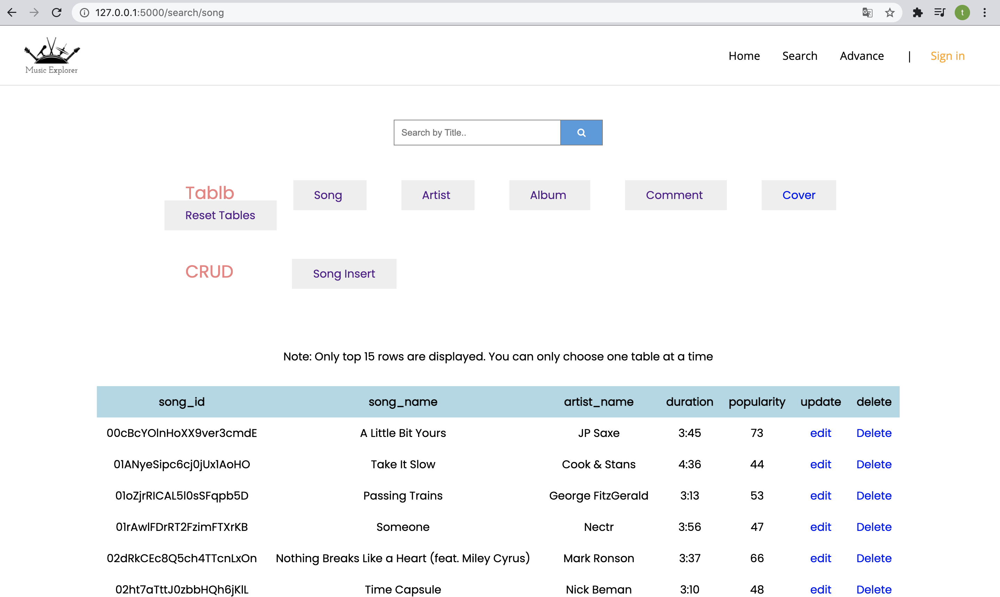
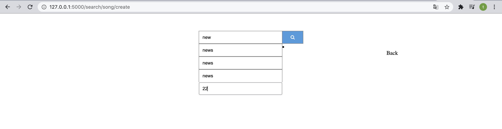
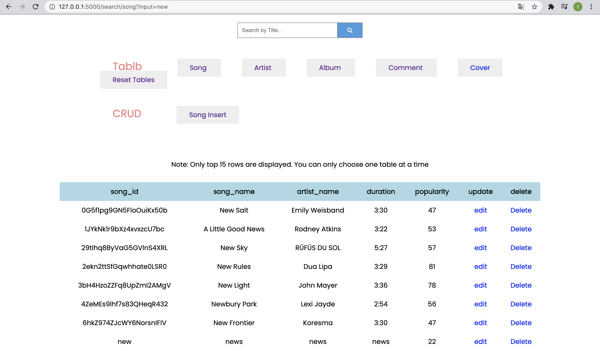
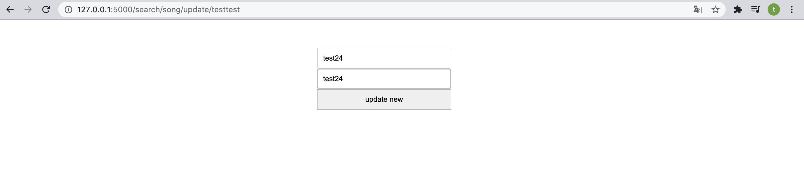
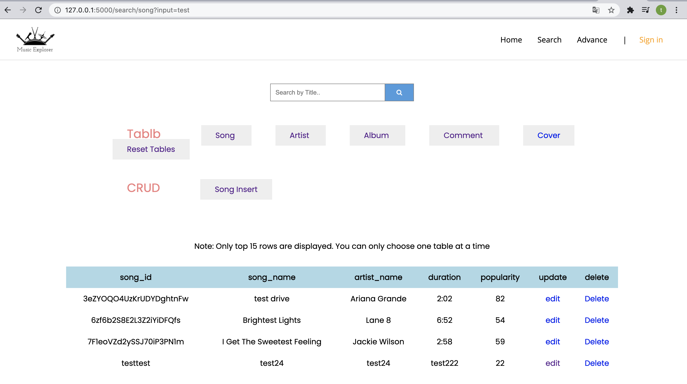
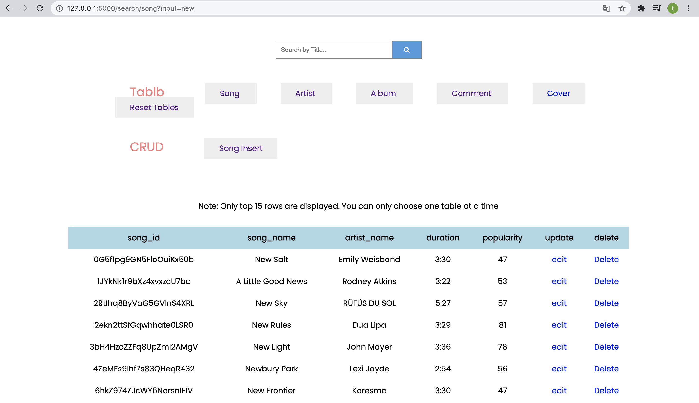
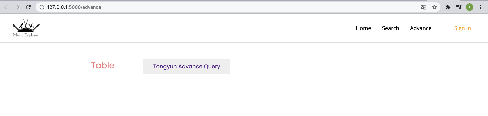
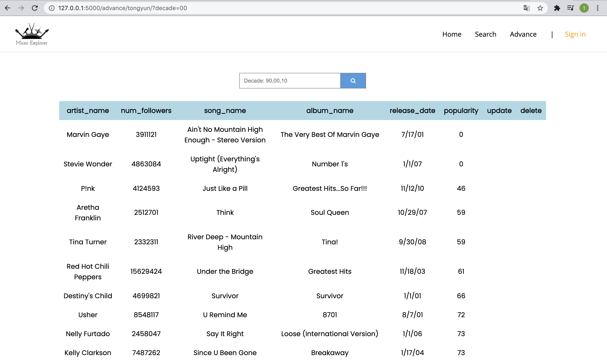

# MusicExplorer
CS411 Final Project

Updated Apr 10 8:30 pm
### Project Structure
```
.
├── README.md
├── app
│   ├── __init__.py
│   ├── database.py                [Other defined DB operation]
│   ├── routes.py                  [Other defined routing, basically reading from DB]
│   ├── songDB.py                  [DB operation for song and TH adv query]
│   ├── songRoutes.py              [Routing for Song crub and TH adv query]
│   ├── static
│   │   ├── css                    [CSS folder]
│   │   │   ├── images
│   │   │   │   └── ...
│   │   │   └── style.css
│   │   ├── images
│   │   │   └── ...
│   │   ├── music
│   │   │   └── ...
│   │   └── script
│   │       ├── app.js             [Not called]
│   │       └── model.js           [Not called]
│   └── templates
│       ├── adv_sql_index.html     [index page for advance queries, add you adv query entry here]
│       ├── index.html             [Start page]
│       ├── search.html            [Search page, all main table display here]
│       ├── sign_in.html           [sign in page, UNFINISH not needed in mt demo]
│       ├── song_form.html         [by TH, new song insert form]
│       ├── song_update.html       [by TH, old song update form, only song_name and artist_name can be updated]
│       └── tongyun_adv_sql.html   [by TH, advance query interface]
├── app.yaml                       [Database attributes defined here]
└── main.py                        [flask run starts here]
```

### Usage
- Index page


- Search Page


- Song display


- Song CRUB: Search by key


- Song CRUB: insert



- Song CRUB: update
    - Update form
    

    - Change value
    

    - Updated res
    

- Song CRUB: delete


- Advance query index


- TH Advance query



